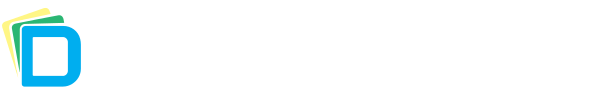
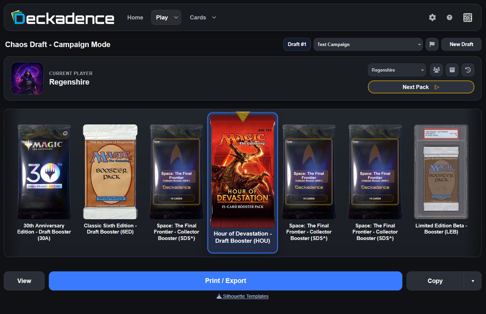
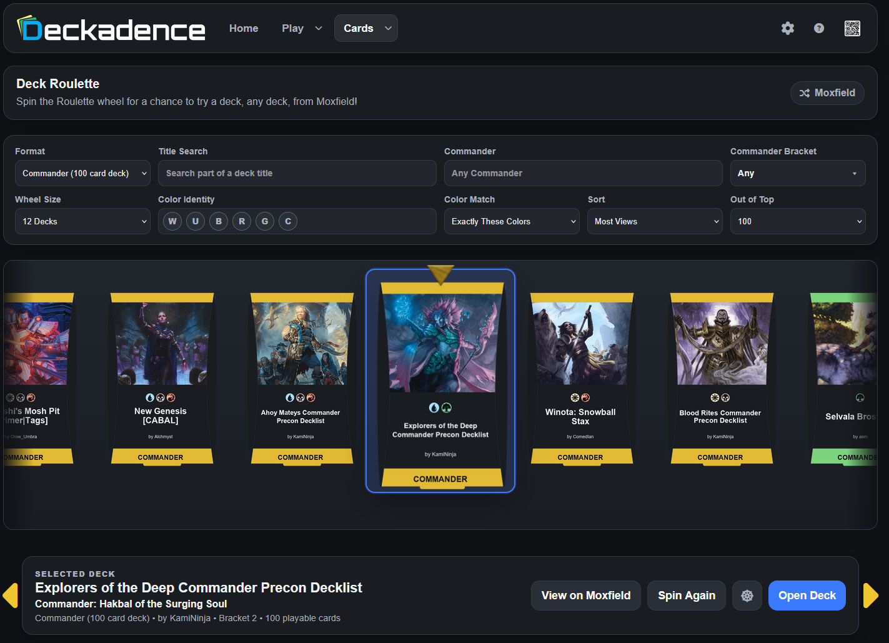
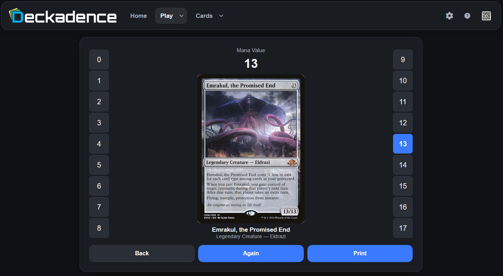
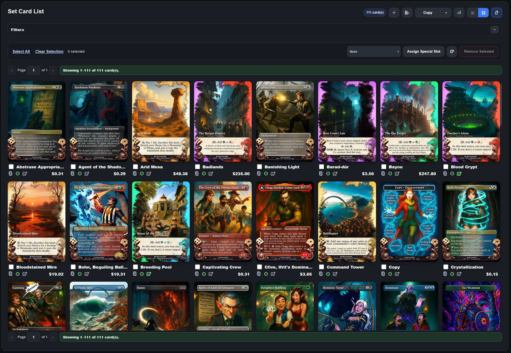
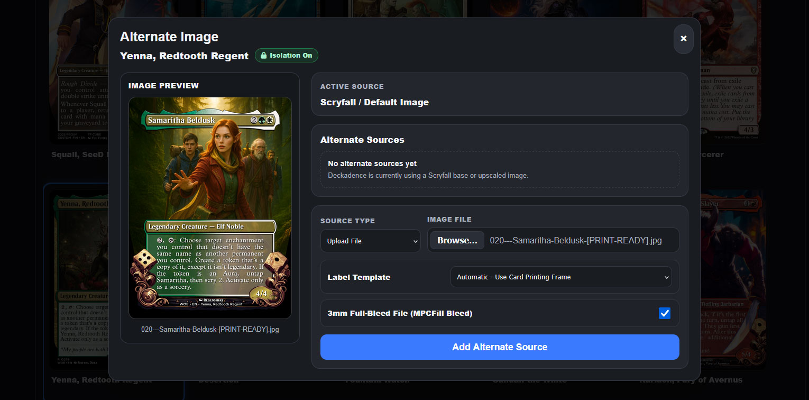
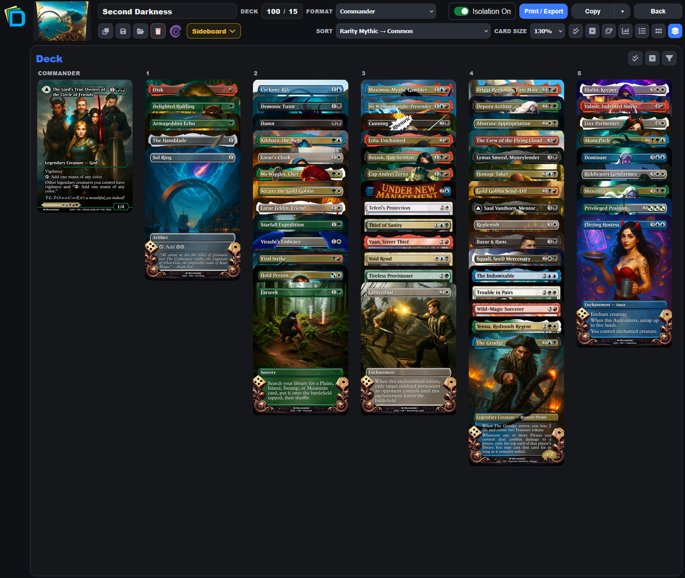

# Deckadence

<p align="center">
  
</p>

## Custom Set Management & Testing Tool | Design -> Proxy -> Test

Deckadence is a self-hosted local Windows web application for creating, managing, printing, and playtesting with Magic: The Gathering cards from any set, deck, or pack. Deckadence support Chaos Drafts, custom draft sets and cubes, deck management, proxy printing, draft testing, card-image management, and optional AI image upscaling in one application.

Deckadence runs on your own PC and opens in a web browser. Your Deckadence database, settings, custom sets, decks, cached images, and generated files are stored locally with the application. No account or hosted Deckadence service is required. You can also open Deckadence from a phone, tablet, or another computer on the same local network.

## What Deckadence Can Do

- **Build custom sets, cubes, and drafts.** Create custom draft sets and chaos draft pools that use cards from any set.
- **Run Chaos Drafts and manage packs.** Open boosters in the Chaos draft mode, build pre-printed pack pools, track opened packs, and use campaign and draft-testing tools.
- **Build and manage decks.** Use the Deck Builder to organize cards, change printings, manage sideboards and basic lands, and prepare decks for playtesting or proxy printing.
- **Create high-quality proxy print files.** Generate PDFs using configurable print templates, card backs, bleed, cutting guides, multi-card sheets, pack labels, and Silhouette-compatible layouts.
- **Control card artwork and printings.** Use existing artwork, select alternate printings, use alternate image sources, and optionally install AI upscaling plugins for higher-resolution proxy images.
- **Keep everything local.** Deckadence is designed to run from your own PC without a Deckadence account or cloud database. Local backup/export tools are included, and the application can be shared with devices on your home network using the built-in QR code.
- **Proxy PDF Generation.** Generate PDFs or export image files for playtest card printing.
- **Silhouette Support.** Deckadence supports Silhouette Cameo cutters.

Deckadence is intended for personal set building, proxy creation, playtesting, and casual play. It is not intended for commercial proxy production or sanctioned tournament play.

---

# Minimum Requirements

Deckadence is a local application and stores its database, downloaded card data, cached card images, custom artwork, decks, custom sets, generated files, and other user-created content on the computer running the application.

Because Deckadence is designed to work with large collections of card images and other media, **available storage space is an important consideration**. Storage usage will increase over time as additional images and content are downloaded, uploaded, or generated.

| Component            | Minimum                                                                 |
| -------------------- | ----------------------------------------------------------------------- |
| **Operating System** | Windows 10 or Windows 11, 64-bit                                        |
| **Processor**        | 64-bit dual-core processor                                              |
| **Memory**           | 8 GB RAM or more                                                        |
| **Free Storage**     | **20 GB** (50+ GB recommended)                                          |
| **Browser**          | Current version of a modern web browser                                 |
| **Internet**         | Required for initial card database setup and online data/image features |

### Storage Considerations

The **20 GB minimum** provides enough working space for Deckadence itself, its local databases, application data, and a collection of cached and uploaded images. It should not be considered sufficient for a very large long-term proxy library with a ton of high resolution image uploads.

Users who maintain large collections of high-resolution card images, alternate artwork, custom sets, generated proxies, backups, or upscaled images should consider **50 GB or more** of available storage.

Deckadence does not require every card image to be downloaded in advance. It downloads images as cards are viewed and used in the application. Images are downloaded and cached locally. Storage consumption depends heavily on how the application is used. Large image libraries can eventually consume tens of gigabytes.

### Additional Notes

- A dedicated graphics card is **not required** for normal Deckadence use.
- Python is **not required** when using the packaged Windows release.
- Optional AI image-upscaling plugins may have substantially higher CPU, GPU, memory, and storage requirements.

---

# Installation

## Windows Release

The packaged Windows release is the easiest way to use Deckadence. You do **not** need to install Python or any of Deckadence's programming dependencies.

1. Download the latest `Deckadence_vX.X.X_Windows.zip` from the [Deckadence GitHub Releases page](https://github.com/Regenshire/Deckadence/releases).
2. Right-click the ZIP file and choose **Extract All**. Do not run Deckadence from inside the ZIP archive.
3. Move or keep the extracted `Deckadence` folder in a normal location where your Windows account can save files, such as Documents or another folder you control. Avoid placing it inside `Program Files`.
4. Open the extracted `Deckadence` folder.
5. Run **`Start_Deckadence.bat`**. This starts Deckadence and opens it in your default browser.

You can also run **`Deckadence.exe`** directly. The Deckadence window will display the local and network addresses you can open in a browser.

Deckadence normally uses:

```text
http://127.0.0.1:5000
```

Keep the Deckadence program window open while using the application. Closing that window stops Deckadence.

### Windows Firewall

Windows may ask whether Deckadence is allowed to communicate on your network. If you want to open Deckadence from a phone, tablet, or another computer on your home network, allow access on **Private networks**.

Deckadence does not need to be exposed to the public Internet.

---

# First-Time Use

An Internet connection is required for the initial card database download and for features that download card data or images.

## 1. Start Deckadence

Run `Start_Deckadence.bat`. Your browser should open Deckadence automatically.

If the browser does not open, use the local address shown in the Deckadence program window. The normal local address is:

```text
http://127.0.0.1:5000
```

## 2. Accept the Personal Use Agreement

The first time Deckadence opens, you will be asked to accept the Personal Use Agreement. Deckadence is intended for personal, non-commercial set building and playtesting.

## 3. Download the Card Database

Before most Deckadence features can be used, the local card database must be created.

1. Open **Settings**.
2. Open the **Card Database** section.
3. Select **Download Card Database**.
4. Allow the download and import process to finish.

The first database setup can take some time because Deckadence downloads and processes Magic card, set, and booster information for local use.

## 4. Start Using Deckadence

After the card database is ready, the main areas of the application are available:

- **Play** contains Chaos Draft, campaigns, draft testing, and Momir-style game modes.
- **Cards** contains Decks, Custom Sets, Packs, and related card-management tools.
- **Settings** contains card database maintenance, printing options, image settings, plugins, backups, and other application preferences.

Card images do not need to be downloaded all at once. Deckadence can cache images as they are needed, and image-management tools are available if you prefer to prepare images ahead of time.

## 5. Optional: Use Deckadence From Another Device

Deckadence can be opened from another computer, phone, or tablet connected to the same local network.

Use the **QR code button** in the Deckadence navigation bar, or enter the network address shown by Deckadence into the other device's browser.

For example:

```text
http://192.168.1.50:5000
```

The exact address depends on the computer running Deckadence.

## 6. Optional: Install an Image Upscaler

Deckadence provides seperate image upscaling addons. These optional addons all Deckadence to use local language models hosted on your PC to upscale images.

Compatible upscalers can be managed under:

**Settings → Plugins → Plugin Manager**

Upscaling plugins are installed separately from the main Deckadence application because the LLM libraries and hardware requirements are significantly larger than the core application.

---

# Technical Information

Deckadence is written in Python and uses a local web interface. The packaged Windows release includes the Python runtime and Deckadence's normal runtime libraries, so end users do not need to install Python separately.

The packaged application uses **Waitress** as its local HTTP server and **Flask** as the application framework. Application data is stored locally using **SQLite** and normal files inside the Deckadence installation.

For development from source, Python 3.12 64-bit is recommended. Exact package versions are maintained in `requirements.txt`.

Deckadence is intended for personal local network use only. It is not intended for use as an internet service. We recommending closing the application when not in use.

## Main Python Dependencies

- **Flask** — application and web-interface framework
- **Waitress** — local application server used by the packaged release
- **Jinja2** — HTML template rendering
- **Werkzeug** — Flask HTTP and utility support
- **Pillow** — card, artwork, and image processing
- **ReportLab** — PDF creation and print layouts
- **pypdf** — PDF processing and combination
- **Requests / urllib3** — downloads and communication with supported third-party data services
- **qrcode / Pillow** — QR-code support
- **CairoSVG** — SVG rendering used by artwork and set-icon workflows
- **PyInstaller** — creates the packaged Windows application

Deckadence also uses supporting Python packages including `blinker`, `certifi`, `charset-normalizer`, `click`, `colorama`, `idna`, `itsdangerous`, `MarkupSafe`, and `setuptools`. These are bundled or installed as part of the normal application/build requirements.

Optional Deckadence plugins can have their own dependencies. For example, AI upscaling plugins may install PyTorch and hardware-specific libraries in their own isolated plugin environment.

## Running From Source

For developers or advanced users:

```powershell
py -3.12 -m venv .venv
.\.venv\Scripts\Activate.ps1
python -m pip install -r requirements.txt
python app.py
```

Then open:

```text
http://127.0.0.1:5000
```

---

# Privacy and Third-Party Services

## No Deckadence Telemetry

Deckadence does not include usage analytics, advertising tracking, or Deckadence-operated telemetry service.

Deckadence does not upload your saved decks, custom sets, campaigns, settings, locally cached card images, or generated proxy files to an online server. These items are stored locally on the computer hosting Deckadence.

Deckadence does make normal Internet requests when you use features that require external data, images, release information, or optional plugins. Those third-party services may receive normal network information associated with the request, such as your public IP address and browser/application request information. These requests may include downloading files from MTGJson, files from Scryfall, and information from Moxfield.

## Services Used by Deckadence

- **MTGJSON** — provides Magic card data, set information, booster definitions, and supported pricing data used to build Deckadence's local databases.
- **Scryfall** — provides card images, bulk card information, set information, and set icons used by Deckadence image and card workflows.
- **GitHub** — hosts Deckadence releases and optional plugin packages. Deckadence can check GitHub for a newer release and can download selected plugins from GitHub when requested.
- **Moxfield** — used only when you choose Deckadence features that search for or import an external Moxfield deck.
- **cdnjs / Font Awesome** — provides the Font Awesome icon stylesheet used by the browser interface.

Third-party services are independent of Deckadence and are governed by their own availability, terms, and privacy practices.

---

# Responsible Use and Legal Information

Deckadence is an unofficial fan-made application intended for **personal, non-commercial set building, proxy creation, casual play, and playtesting purposes only**.

By using Deckadence, you are responsible for how you use the application and any material you create, download, upload, print, or share with it.

Please use Deckadence responsibly:

- Proxies and playtest cards created with Deckadence are not intended for resale or commercial distribution.
- Proxies created with Deckadence are not represented as genuine Magic: The Gathering cards and are not intended for sanctioned tournament play.
- Follow the rules of your local game store, tournament organizer, play group, or venue when using proxies or playtest cards.
- You are responsible for ensuring that your use of Deckadence complies with applicable laws and the terms of any third-party service you choose to use.
- Deckadence does not grant any license or ownership rights to Magic: The Gathering card artwork, names, symbols, rules text, trademarks, or other third-party intellectual property.

Deckadence is not affiliated with, endorsed by, sponsored by, or approved by Wizards of the Coast.

**Magic: The Gathering**, Magic card names, card artwork, symbols, rules text, and related trademarks and intellectual property are the property of Wizards of the Coast and/or their respective rights holders.

Deckadence is provided without warranty under the terms of its software license. Users are responsible for maintaining backups of any Deckadence data they consider important.

Please support your local game stores and the creators whose games and artwork make projects like this possible.

---

# License

Deckadence is released under the MIT License. See [`LICENSE.txt`](LICENSE.txt) for the full license text.

# Credits

Deckadence relies on data and services provided by projects including **MTGJSON** and **Scryfall**, and is built using a number of open-source Python libraries listed above and in `requirements.txt`.

Optional upscaling plugins use separately distributed open-source machine-learning libraries and models and are not required for normal Deckadence use.

# Screenshots

<p align="center">
  
  <br>
  <em>Roll on a Chaos Draft spinner for curated or random packs</em>
</p>
<p align="center">
  
  <br>
  <em>Spin on the Deck Roulette for deck ideas</em>
</p>

<p align="center">
  
  <br>
  <em>Play Momir with friends</em>
</p>

<p align="center">
  
  <br>
  <em>Custom Set — Manage the cards in custom sets</em>
</p>

<p align="center">
  
  <br>
  <em>Set Alternate Images</em>
</p>

<p align="center">
  
  <br>
  <em>Use the Deckbuilder to create and manage deckss</em>
</p>
